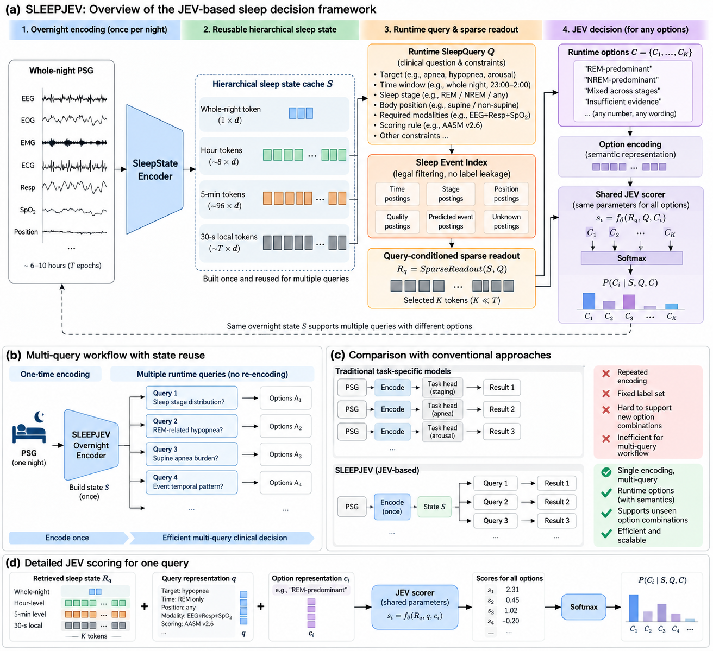
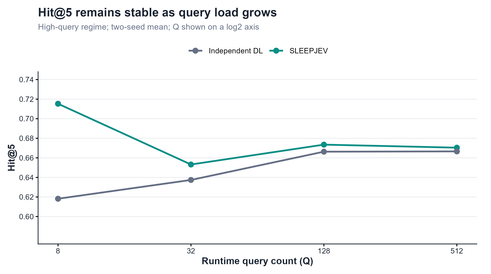
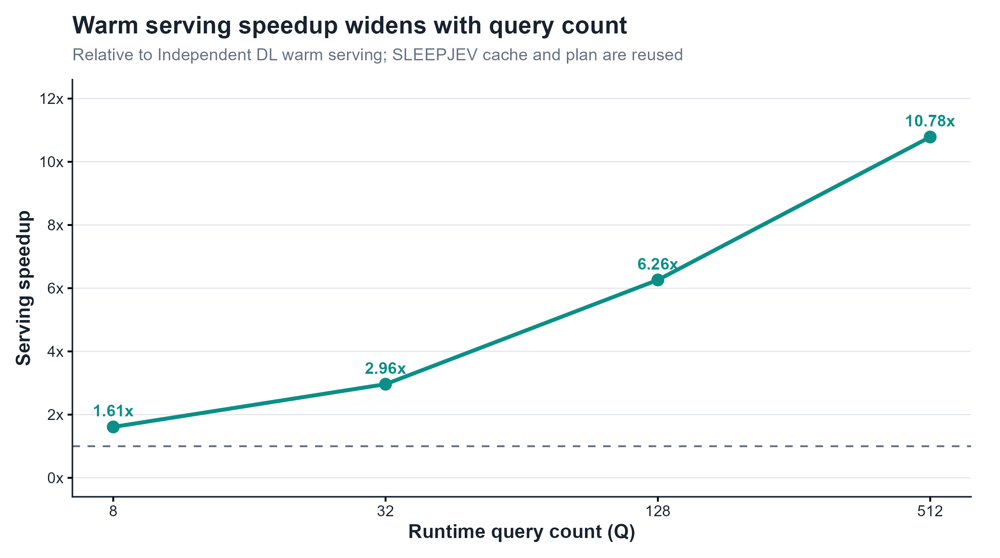
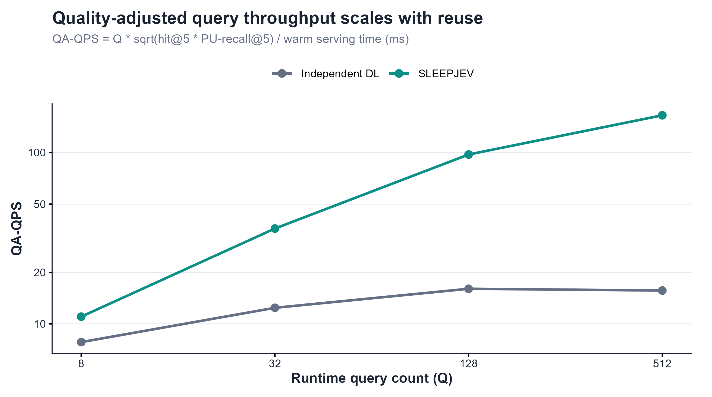

<p align="center">
  
</p>

<p align="center">
  <strong>Runtime semantic decisions for long-horizon PSG.</strong><br>
  Reusable overnight encoding · sparse temporal retrieval · runtime option scoring
</p>

<p align="center">
  <a href="https://github.com/liuyisi123/SLEEPJEV/actions/workflows/ci.yml"></a>
  <a href="LICENSE"></a>
  
  
</p>

<p align="center">
  <a href="#jev-in-sleepjev">JEV design</a> ·
  <a href="#method-at-a-glance">Method</a> ·
  <a href="#high-query-workload-results">Results</a> ·
  <a href="README.zh-CN.md">Chinese documentation</a>
</p>

> **Research prototype.** SLEEPJEV is not a medical device, diagnostic system, or source of clinical advice. It has not been validated for patient care or deployment.

SLEEPJEV is a signal-native research implementation for asking many explicit,
runtime sleep questions over one long polysomnography (PSG) recording. It encodes
the overnight signal once, builds serving indexes over the resulting state, reads a
query-conditioned subset of time tokens, and scores the options supplied by the
query at runtime.



<p align="center"><sub>One overnight PSG representation supports many runtime semantic decisions.</sub></p>

## Why SLEEPJEV?

<table>
  <tr>
    <td width="50%" valign="top">
      
      <strong>Signal-native</strong><br />
      <sub>One `SleepCache` keeps local, coarse, hourly, and night-level states for a complete recording.</sub>
    </td>
    <td width="50%" valign="top">
      
      <strong>Runtime semantics</strong><br />
      <sub>`SleepQuery` supplies the question and its candidate meanings instead of using one fixed head.</sub>
    </td>
  </tr>
  <tr>
    <td width="50%" valign="top">
      
      <strong>Sparse readout</strong><br />
      <sub>Time, stage, position, and event constraints narrow the state before option scoring.</sub>
    </td>
    <td width="50%" valign="top">
      
      <strong>Workload-oriented</strong><br />
      <sub>The same overnight representation can serve many explicit questions without re-encoding the PSG.</sub>
    </td>
  </tr>
</table>

## JEV in SLEEPJEV

JEV is used here as a design lens for separating **evidence formation** from
**semantic decision**. A decision is defined by three pieces: the evidence being
read, the question being asked, and the candidate meanings that are valid for that
question. SLEEPJEV applies this structure to sleep rather than binding every task to
a permanent classifier head.

| JEV element | SLEEPJEV realization |
| --- | --- |
| Evidence | A shared overnight PSG state: epoch, coarse, hourly, and night tokens plus serving postings. |
| Question | A validated `SleepQuery` with a target, time window, stage or position constraints, and query type. |
| Candidate meanings | `query.options`, such as `("W", "N2", "REM")` or `("negative", "positive")`. |
| Decision | A shared option-conditioned scorer returns probabilities over the options supplied by the current query. |

```text
PSG -> shared evidence state S
(S, question q, candidate set Oq) -> probabilities over Oq
```

For sleep workloads, this separation is useful because the expensive part is often
forming a representation of a long recording, while the question changes from one
workflow step to the next. SLEEPJEV keeps the signal state reusable and defers the
semantic choice until query time. The implementation is **JEV-inspired**; it does
not claim to reproduce an external JEV standard or clinical decision system.

## Method at a glance

```text
Overnight PSG
    -> epoch features
    -> shared hierarchical overnight state
    -> predicted stage/event serving postings
    -> runtime SleepQuery
    -> legal time/stage/position filtering
    -> sparse query-conditioned retrieval
    -> shared option-conditioned scorer
    -> probabilities over runtime options
```

### SLEEPJEV vs. a fixed classifier

| Conventional fixed-head pipeline | SLEEPJEV |
| --- | --- |
| The task and labels are fixed in the model head. | The query supplies the task wording and semantic options at runtime. |
| A new query usually requires a new head or a new task-specific path. | The same shared scorer can compare arbitrary validated option sets. |
| Repeated long-recording work is often repeated per task. | One cached overnight state supports a multi-query workload. |
| Location and classification are commonly separate outputs. | Sparse retrieval and option scoring share the query-conditioned readout. |

This is a systems and representation hypothesis. Runtime options do not, by
themselves, establish better clinical accuracy.

## High-query workload results

The main SLEEPJEV advantage appears when one overnight state serves many runtime
queries. The figures below use the project's final **two-seed averages** and focus on
the high-query regime (`Q >= 8`). The complete comparison is available in
[`docs/results.md`](docs/results.md).

### Query quality stays competitive



| Q | SLEEPJEV hit@5 | Independent DL hit@5 | Relative result |
| ---: | ---: | ---: | ---: |
| 8 | **0.7153** | 0.6182 | **+0.0971** |
| 32 | **0.6532** | 0.6374 | **+0.0158** |
| 128 | **0.6735** | 0.6663 | **+0.0072** |
| 512 | **0.6704** | 0.6666 | **+0.0038** |

Across the high-query points shown here, SLEEPJEV hit@5 remains stable and exceeds
the Independent DL reference. This is a workload-level retrieval result, not a claim
of universal clinical accuracy.

### Serving speedup grows with reuse



| Q | SLEEPJEV steady serving | Independent DL warm | SLEEPJEV speedup |
| ---: | ---: | ---: | ---: |
| 8 | 0.213 ms | 0.343 ms | **1.61x** |
| 32 | 0.245 ms | 0.726 ms | **2.96x** |
| 128 | 0.359 ms | 2.248 ms | **6.26x** |
| 512 | 0.833 ms | 8.983 ms | **10.8x** |

These are warm serving measurements after the overnight cache and query plan are
available. EDF I/O and one-time cache construction are excluded.

### Quality-adjusted throughput



We report a conservative composite rather than raw latency alone:

```text
QAI = sqrt(hit@5 * PU-recall@5)
QA-QPS = Q * QAI / serving_time_ms
quality-retained speedup = raw speedup * min(1, QAI_SLEEPJEV / QAI_baseline)
```

| Q | SLEEPJEV QA-QPS | Independent DL QA-QPS | Quality-retained speedup |
| ---: | ---: | ---: | ---: |
| 8 | **11.0197** | 7.8274 | **1.41x** |
| 32 | **36.0098** | 12.4121 | **2.90x** |
| 128 | **97.3727** | 16.0285 | **6.08x** |
| 512 | **164.9095** | 15.6570 | **10.53x** |

At `Q=512`, sparse SLEEPJEV readout is **25.8x** faster than dense JEV readout
(`0.833 ms` vs `21.520 ms`) with the same learned event score and reported
`exact match=True`.

### Headline result

| Workload property | SLEEPJEV result |
| --- | ---: |
| Best high-Q hit@5 across Q=8, 32, 128, 512 | **4 / 4 points** |
| Q=512 warm serving speedup vs Independent DL | **10.8x** |
| Q=512 quality-retained speedup | **10.53x** |
| Q=512 sparse vs dense JEV readout | **25.8x** |
| Sparse vs dense event score agreement | **Exact match reported** |

Taken together, these measurements support a narrower claim: SLEEPJEV is designed
for high-Q serving, where one overnight representation is reused across many
explicit questions. They do not establish universal clinical superiority.

To regenerate the plots from the checked-in release data:

```bash
# Windows: use the installed Rscript executable if it is not on PATH.
Rscript scripts/plot_results.R
```

## Repository layout

```text
SLEEPJEV-GitHub/
├── src/sleepjev/          # public package: types, model, index, data, training
├── examples/              # synthetic demos that require no private data or weights
├── benchmarks/            # reproducible query-reuse runner and configs
├── scripts/                # R plotting and release-data utilities
├── tests/                 # API, indexing, sparse-readout, and workload contracts
├── docs/                   # method, data, evaluation, benchmark, and release notes
├── docs/assets/            # logo, scientific diagrams, and release plots
├── .github/workflows/     # CI, lint, compile, and package build
├── pyproject.toml         # package metadata and optional dependencies
├── CITATION.cff
└── LICENSE
```

## Installation

Python 3.10--3.12 is supported. Install a PyTorch wheel appropriate for the target CPU, CUDA, or ROCm environment first when a custom build is needed.

```bash
python -m venv .venv
source .venv/bin/activate

# Windows PowerShell: .venv\Scripts\Activate.ps1
python -m pip install --upgrade pip
python -m pip install -e ".[test,dev]"
```

Optional extras:

```bash
python -m pip install -e ".[sleep]"   # EDF/XML and tabular utilities
python -m pip install -e ".[train]"   # training-time data utilities
python -m pip install -e ".[all]"     # all published extras
```

## Quick start: synthetic runtime queries

The following uses only generated features and an untrained model. It demonstrates the public contract, not useful medical predictions.

```python
import numpy as np
import torch

from sleepjev import SleepJEV, SleepNight, SleepQuery

features = np.random.default_rng(7).normal(size=(120, 6)).astype("float32")
stages = np.asarray(["W", "N1", "N2", "N3", "REM"] * 24)
night = SleepNight("demo", features, stages)

model = SleepJEV(input_dim=night.feature_dim, hidden_size=32, coarse_factor=2, hour_factor=8).eval()
cache = model.encode(torch.from_numpy(night.features))

queries = [
    SleepQuery("sleep_stage", options=("W", "N2", "REM"), start_epoch=10, end_epoch=40),
    SleepQuery("apnea", "boolean", ("negative", "positive"), start_epoch=0, end_epoch=80),
]

for answer in model.answer(cache, queries):
    print(answer)
```

Equivalent CLI smoke tests:

```bash
python -m sleepjev demo
python -m sleepjev benchmark
# after installation:
sleepjev demo
```

## Data preparation

SLEEPJEV consumes a feature-level `SleepNight` contract. The first data adapter supports local Sleep-EDF and NSRR-style EDF/XML layouts; it extracts epoch-level signal features and stage/event annotations without bundling any dataset.

```python
from sleepjev import load_sleep_edfx

night = load_sleep_edfx("/path/to/SC4001E0-PSG.edf", "/path/to/SC4001EC-Hypnogram.edf")
```

Dataset access, licenses, channel assumptions, annotation normalization, and feature schema are documented in [`docs/data.md`](docs/data.md). Do not commit EDF files, identifiable signals, checkpoints, or credentials.

## Training and evaluation

The library exposes focused functions for a small pilot workflow:

```python
from sleepjev.train import evaluate_sleepjev_tasks, fit_sleepjev_tasks

fit_sleepjev_tasks(model, train_nights, epochs=5)
metrics = evaluate_sleepjev_tasks(model, test_nights)
print(metrics)
```

For fixed-head comparisons, use `FixedHeadDL` with `fit_fixed_baseline` and `evaluate_fixed_baseline`. For query workloads, use `evaluate_sleepjev_workloads` and report query count, candidate count, top-k positive retrieval, and the positive-unlabeled policy together.

```bash
python benchmarks/run_query_reuse.py --epochs 640 --feature-dim 6 --output benchmark.json
```

Tests and the package build are the minimum reproducibility gate:

```bash
pytest -q
python -m build
```

## Limitations

- The current package is an alpha research prototype, not a clinical product.
- The included feature adapter is a compact baseline, not a validated clinical preprocessing pipeline.
- The published snapshot is a two-seed average, but it is not yet a complete
  cross-dataset benchmark with a public experiment manifest.
- Event annotations can be positive-unlabeled; retrieval metrics must not be read as event sensitivity.
- Untrained models and synthetic examples are API demonstrations only.
- Checkpoints, official splits, calibration manifests, and large raw artifacts are intentionally external.

See [`docs/limitations.md`](docs/limitations.md) and [`docs/release.md`](docs/release.md) before making a public performance claim.

## Documentation

- [`docs/overview.md`](docs/overview.md): project scope and terminology
- [`docs/method.md`](docs/method.md): model, JEV contract, and serving path
- [`docs/codebase.md`](docs/codebase.md): module ownership and extension points
- [`docs/data.md`](docs/data.md): data contract and annotation policy
- [`docs/training.md`](docs/training.md): pilot training workflow
- [`docs/evaluation.md`](docs/evaluation.md): metrics and evaluation discipline
- [`docs/benchmarks.md`](docs/benchmarks.md): query-reuse and workload protocol
- [`docs/results.md`](docs/results.md): final two-seed results and claim boundary
- [`docs/repo-style-references.md`](docs/repo-style-references.md): public repository design references
- [`docs/faq.md`](docs/faq.md): common questions
- [`docs/release.md`](docs/release.md): public-release checklist

## Citation

The citation metadata is in [`CITATION.cff`](CITATION.cff). The paper or preprint
citation is pending until the authors provide the final bibliographic record.

## License and contact

Code is released under the MIT License in [`LICENSE`](LICENSE). Dataset and checkpoint licenses remain separate. Please use GitHub issues for reproducible bugs and include the commit, Python/PyTorch versions, device, query contract, and a minimal synthetic reproduction.

Maintainer and institutional attribution are pending; placeholders in badges and
citation metadata must be replaced before publication.
